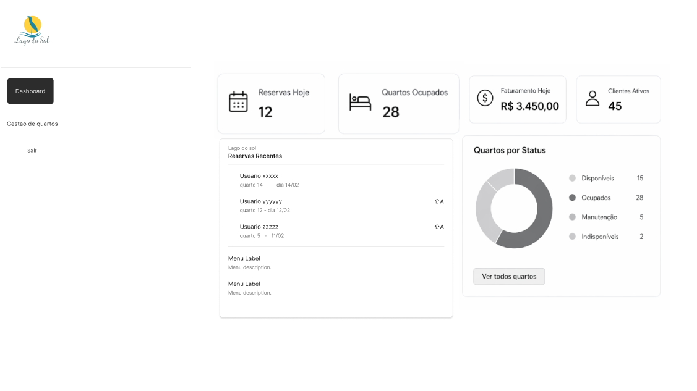
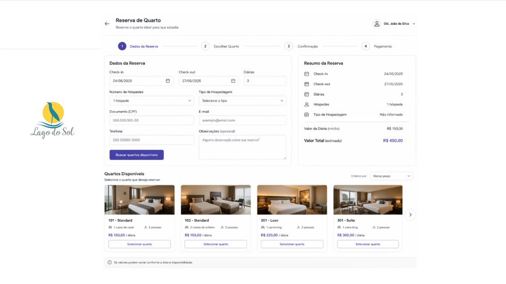
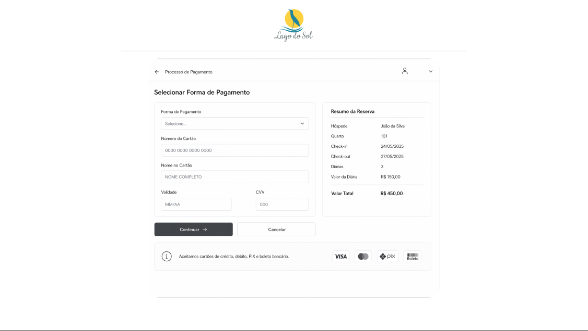
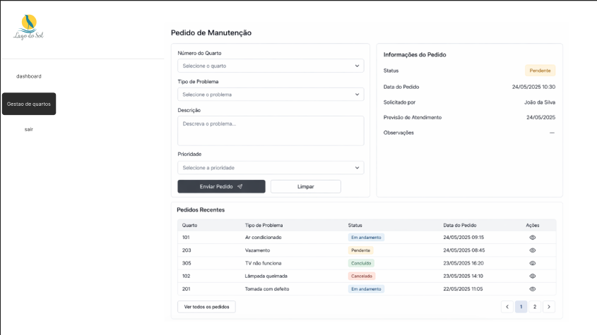
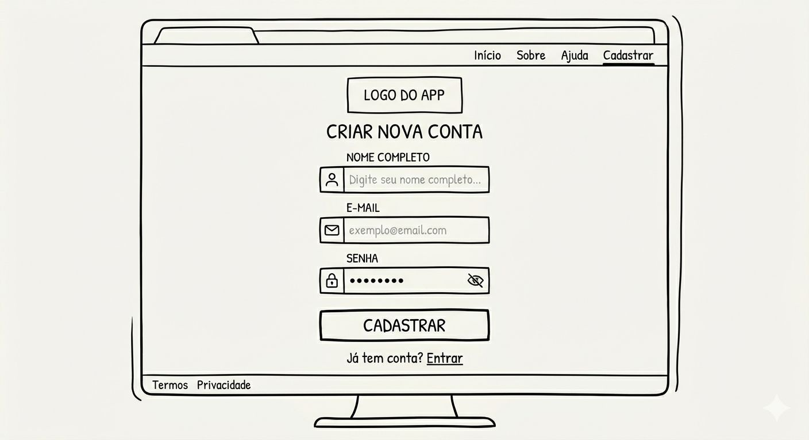

6. Interface do sistema

A interface do sistema foi projetada com foco na usabilidade, organização visual e eficiência na execução dos processos operacionais da hotelaria. As telas foram estruturadas de forma padronizada, contendo menu lateral de navegação, área principal de conteúdo e painéis auxiliares, permitindo ao usuário acessar rapidamente as funcionalidades essenciais do sistema.

As principais interfaces contemplam os processos de gestão, reserva e pagamento, além de um Dashboard com visão geral do sistema.

6.1. Dashboard do sistema

O Dashboard do sistema apresenta uma visão consolidada das operações do hotel. Nessa tela, o usuário visualiza indicadores estratégicos como número de reservas do dia, quantidade de quartos ocupados, faturamento diário e número de clientes ativos.

Além dos indicadores, o dashboard contém uma seção de reservas recentes, permitindo o acompanhamento das últimas movimentações realizadas no sistema, e um painel de status dos quartos, que apresenta a distribuição entre quartos disponíveis, ocupados, em manutenção e indisponíveis.

O menu lateral permite acesso rápido às demais funcionalidades, como reserva de quartos, processo de pagamento, gestão de quartos, relatórios e configurações.

6.2. Telas do processo 1 (Reserva de quarto)
Descrição da tela relativa à atividade 1

A primeira tela do processo de reserva corresponde ao preenchimento dos dados da reserva. Nessa etapa, o usuário informa dados como data de check-in e check-out, número de hóspedes, tipo de hospedagem, documento, e-mail e telefone.

A interface também apresenta um botão para busca de quartos disponíveis com base nos critérios informados, permitindo a continuidade do processo.

Descrição da tela relativa à atividade 2

A segunda tela apresenta os quartos disponíveis para seleção. Os quartos são exibidos em formato de cards contendo informações como número do quarto, tipo, capacidade e valor da diária.

Após a seleção do quarto, o sistema exibe um resumo da reserva, com dados consolidados da estadia, incluindo datas, quantidade de diárias e valor total estimado, permitindo ao usuário confirmar a reserva.

6.3. Telas do processo 2 (Processo de pagamento)
Descrição da tela relativa à atividade 1

A primeira tela do processo de pagamento permite ao usuário selecionar a forma de pagamento, podendo optar entre cartão de crédito, débito, PIX ou boleto.

Caso a opção seja cartão, são solicitados dados como número do cartão, nome do titular, validade e código de segurança (CVV). A interface valida os dados obrigatórios antes de permitir a continuidade.

Descrição da tela relativa à atividade 2

A segunda tela apresenta o resumo da reserva, contendo informações do hóspede, datas da estadia, número de diárias, valor da diária e valor total.

Nessa etapa, o usuário pode confirmar o pagamento ou cancelar a operação. Após a confirmação, o sistema realiza o registro do pagamento e gera a confirmação da reserva.

6.4. Telas do processo 3 (Gestão de quartos)
Descrição da tela relativa à atividade 1

A tela de gestão de quartos permite o registro de pedidos de manutenção, onde o usuário informa o número do quarto, tipo de problema, descrição e nível de prioridade.

Descrição da tela relativa à atividade 2

A interface também apresenta uma lista de pedidos recentes, contendo informações como número do quarto, tipo de problema, status do atendimento e data da solicitação, permitindo o acompanhamento e controle das atividades de manutenção.

6.5. Tela de Login

A tela de login é responsável por permitir o acesso seguro dos usuários ao sistema. Nessa interface, o usuário deve informar suas credenciais, compostas por e-mail e senha, para autenticação.

A tela apresenta campos de entrada para os dados obrigatórios, além de um botão de ação para realizar o login. Também é disponibilizada a opção de criação de nova conta, direcionando o usuário para a tela de cadastro, caso ainda não possua acesso ao sistema.

Como elemento complementar, a interface pode incluir funcionalidades como visualização da senha, recuperação de acesso e validação de campos, garantindo maior segurança e usabilidade.

A estrutura visual segue o padrão do sistema, com layout simples e centralizado, facilitando a interação do usuário logo no primeiro contato com a plataforma.

