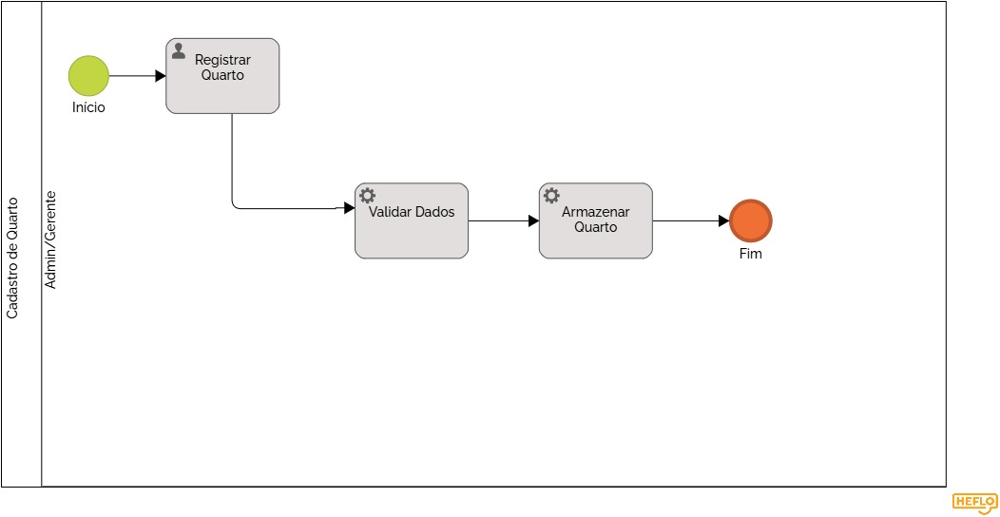

### 3.3.3 Processo 3 – Cadastro de Quarto

## Consulta de Quartos
Ação inicial realizada pelo Admin/Gerente para visualizar os quartos existentes antes de decidir a próxima ação.

| Campo | Tipo | Restrições | Valor default |
| :--- | :--- | :--- | :--- |
| Busca/Filtro | Texto | Opcional | |
| Listagem de Quartos | Grid/Tabela | Visualização | |

| Comandos | Destino | Tipo |
| :--- | :--- | :--- |
| Selecionar Editar | Editar cadastro | Link |
| Selecionar Novo | Cadastrar novo | Botão |
| Selecionar Excluir | Excluir | Botão |

---

## Editar cadastro
Permite a modificação de informações de um quarto já existente no sistema.

| Campo | Tipo | Restrições | Valor default |
| :--- | :--- | :--- | :--- |
| Nome/Número | Texto | Obrigatório | Valor atual |
| Preço/Tipo | Seleção/Número | Obrigatório | Valor atual |

| Comandos | Destino | Tipo |
| :--- | :--- | :--- |
| Salvar Alterações | Fim | Default |
| Cancelar | Consulta de Quartos | Cancel |

---

## Cadastrar novo
Etapa para inclusão de uma nova unidade habitacional no inventário.

| Campo | Tipo | Restrições | Valor default |
| :--- | :--- | :--- | :--- |
| Dados do Quarto | Diversos | Obrigatórios | Vazio |

| Comandos | Destino | Tipo |
| :--- | :--- | :--- |
| Confirmar Cadastro | Fim | Default |
| Cancelar | Consulta de Quartos | Cancel |

---

## Excluir
Remoção do registro de quarto selecionado.

| Campo | Tipo | Restrições | Valor default |
| :--- | :--- | :--- | :--- |
| Confirmação | Alerta/Modal | Obrigatório | |

| Comandos | Destino | Tipo |
| :--- | :--- | :--- |
| Confirmar Exclusão | Fim | Danger |
| Voltar | Consulta de Quartos | Cancel |